## KNEE PUSH-UP
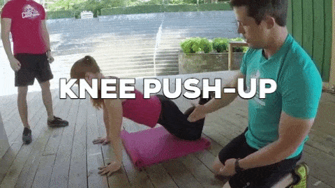

## ELEVATED PUSH-UP
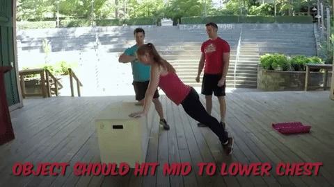

## REGULAR PUSH-UP
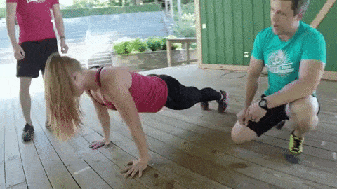

## SPIDER-MAM PRESS-UP
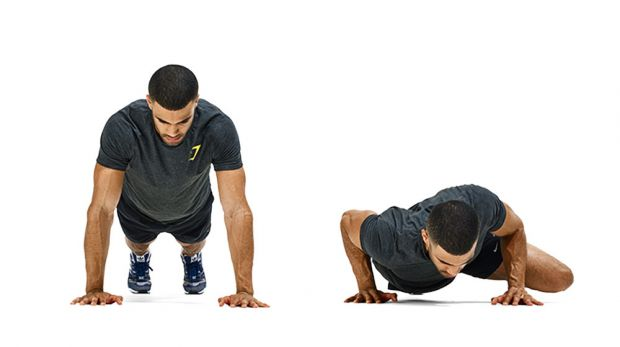

Start in the top of a press-up position. Bend your arms to lower your chest until it’s just off the floor and simultaneously bring one knee up to your elbow, then return to the start. Alternate knees. On the final single rep, make this super-slow – do it over a ten count.

## WIDE-GRIP PRESS-UP
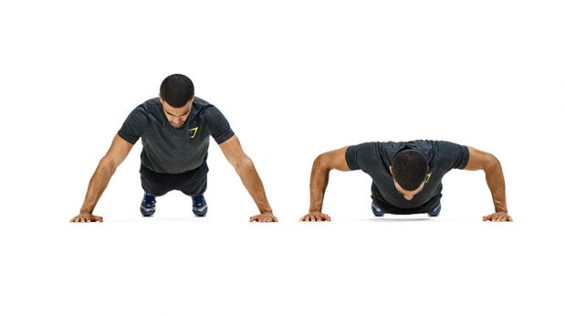

Perform a standard press-up but with your arms double shoulder-width apart. Lower your chest until it’s just off the floor, then press back up until your arms are straight.

## INCLINE CLAP PRESS-UP
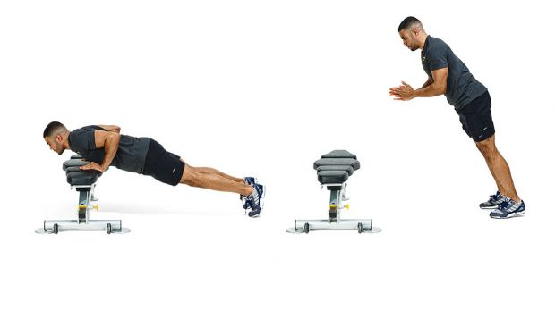

Start in a press-up position with hands elevated. Lower towards the bench, then explode up until you’re almost standing. Clap your hands, put them back out to break your fall and go into the next rep.

## ASSISTED BODYWEIGHT SQUAT
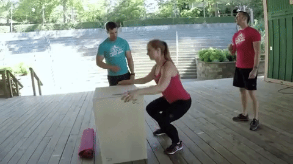

## PROPER BODYWEIGHT SQUAT

## SUPPORTED LUNGES
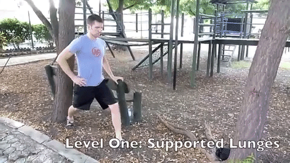

## REGULAR LUNGES

## ONE ARM ROW (Use a milk jug, suitcase, or actual dumbbell)
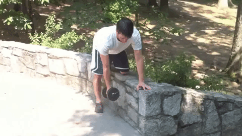

## REVERSE CRUNCH
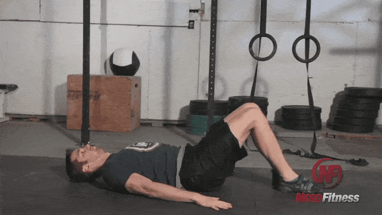

## HANGING KNEE TUCK
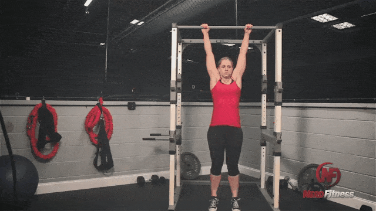

## JUMPING KNEE TUCK
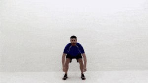

## HOLLOW BODY ROCKING
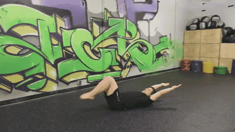

## KNEES TO ELBOWS

## TOES TO BAR
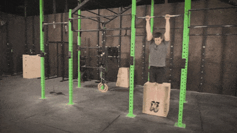

## PLANK
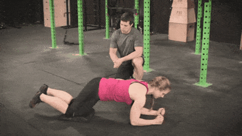

## SIDE
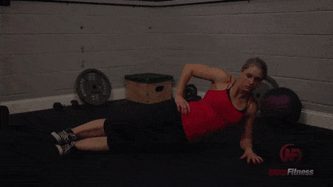

## WALKING JACKS
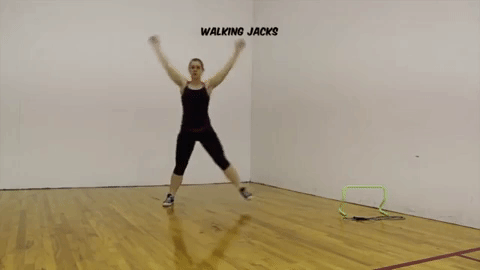

## JUMPING JACKS
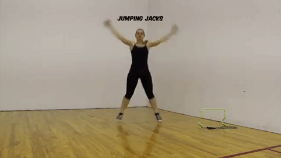

## STAR JACKS
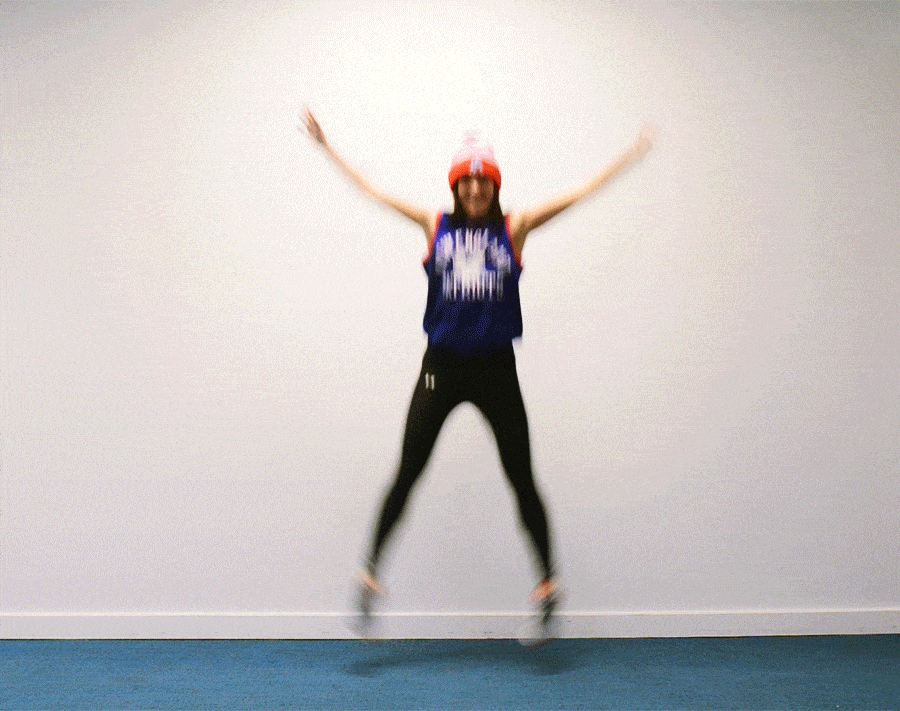

## BURPEES
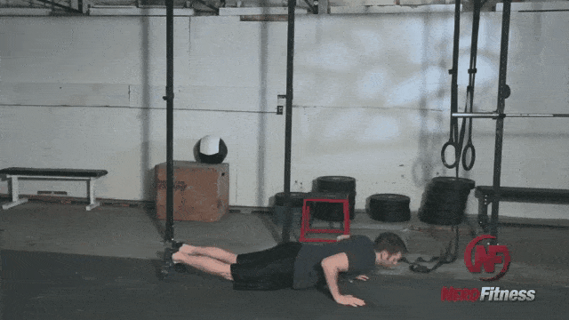

## BURPEES WITH PULL UP

## ASSISTED ONE LEGGED SQUAT
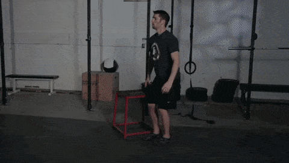

## ONE LEGGED SQUAT (PISTOL SQUAT)
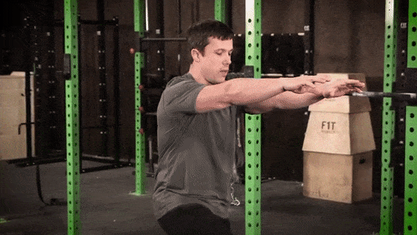

## WALKING LUNGE
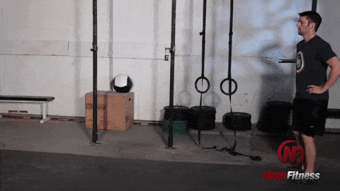

## JUMP STEP-UPS
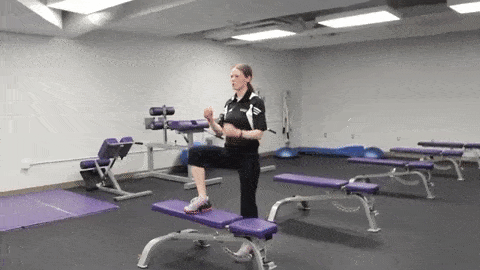

## BAR HANG

## ASSISTED PULL-UPS (WITH BAND)
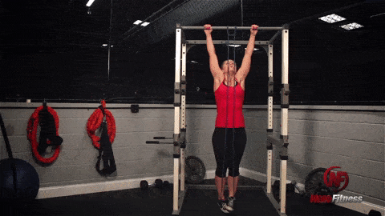

## ASSISTED PULL-UPS (WITH BOX)
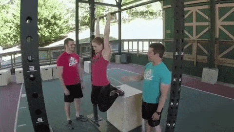

## NEGATIVE PULL-UPS
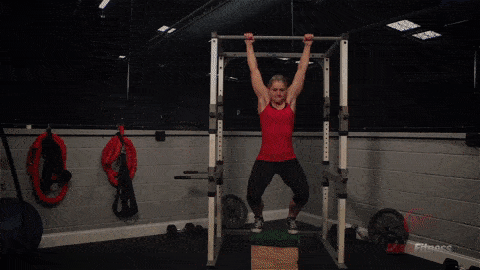

## PULL-UP
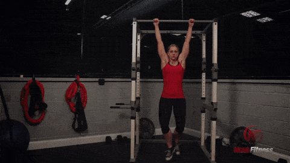

## CHIN-UPS
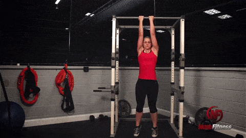

## INVERTED BODYWEIGHT ROW (OVERHAND)
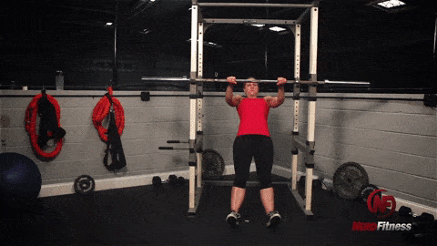

## BODYWEIGHT ROW (LOW)
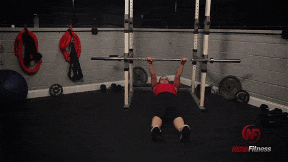

## INVERTED BODYWEIGHT ROW (UNDERHAND)
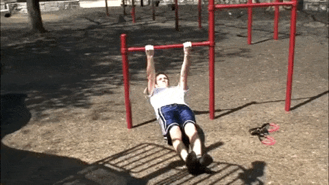

## DOORWAY ROW
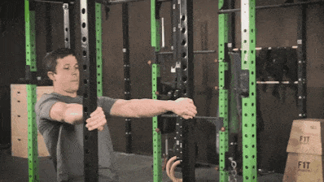

## ASSISTED BODYWEIGHT DIPS
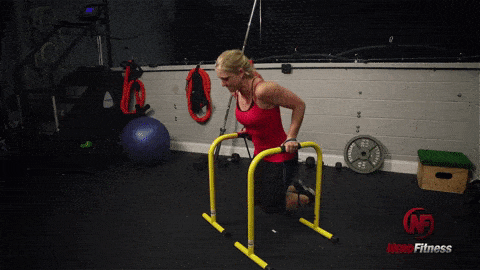

## BODYWEIGHT DIPS
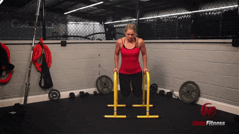

## DECLINE PUSH-UPS

## KNEE PLANK
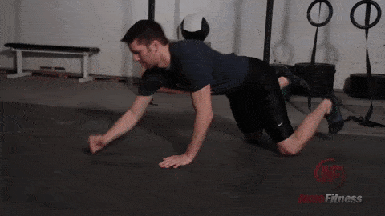

## SINGLE LEG DEADLIFT
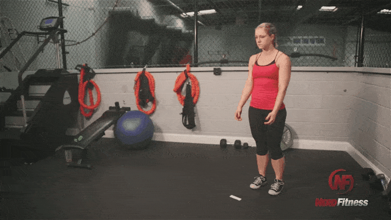

## HIP BRIDGE
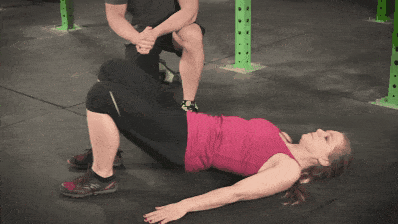

## CALF RAISES

## STEP UP
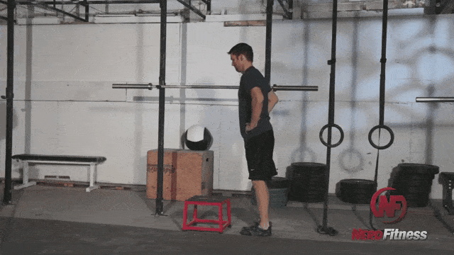

## BOX JUMP

## SIDE TO SIDE PUSH UP
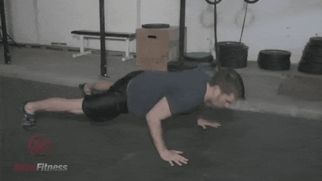

## WALL WALK
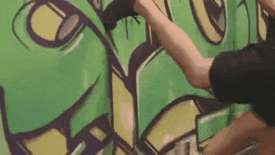

## PIKE PRESS-UP
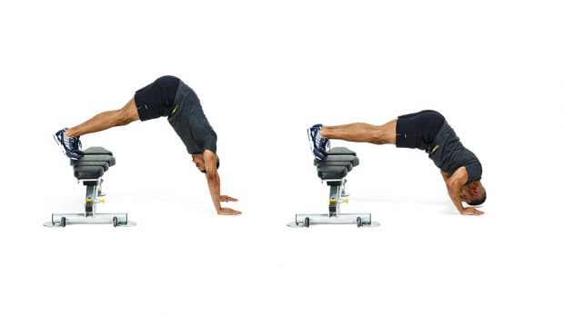

Adopt a press-up position with your feet on a bench and your back and arms in a straight line. Keep your head tucked in and bend your arms to lower your head until it’s just off the floor. Push up.