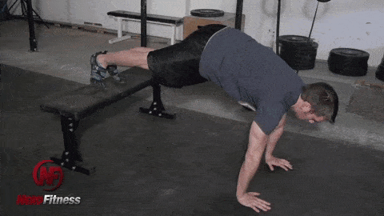
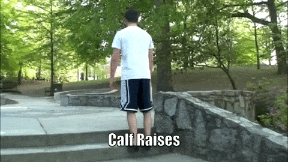

## KNEE PUSH-UP

## ELEVATED PUSH-UP

## REGULAR PUSH-UP

## ASSISTED BODYWEIGHT SQUAT

## PROPER BODYWEIGHT SQUAT

## SUPPORTED LUNGES

## REGULAR LUNGES

## ONE ARM ROW (Use a milk jug, suitcase, or actual dumbbell)

## REVERSE CRUNCH

## HANGING KNEE TUCK

## JUMPING KNEE TUCK

## HOLLOW BODY ROCKING

## KNEES TO ELBOWS

## TOES TO BAR

## PLANK

## SIDE

## WALKING JACKS

## JUMPING JACKS

## STAR JACKS

## BURPEES

## BURPEES WITH PULL UP

## ASSISTED ONE LEGGED SQUAT

## ONE LEGGED SQUAT (PISTOL SQUAT)

## WALKING LUNGE

## JUMP STEP-UPS

## BAR HANG

## ASSISTED PULL-UPS (WITH BAND)

## ASSISTED PULL-UPS (WITH BOX)

## NEGATIVE PULL-UPS

## PULL-UP

## CHIN-UPS

## INVERTED BODYWEIGHT ROW (OVERHAND)

## BODYWEIGHT ROW (LOW)

## INVERTED BODYWEIGHT ROW (UNDERHAND)

## DOORWAY ROW

## ASSISTED BODYWEIGHT DIPS

## BODYWEIGHT DIPS

## DECLINE PUSH-UPS

## KNEE PLANK

## SINGLE LEG DEADLIFT

## HIP BRIDGE

## CALF RAISES

## STEP UP

## BOX JUMP

## SIDE TO SIDE PUSH UP

## WALL WALK
